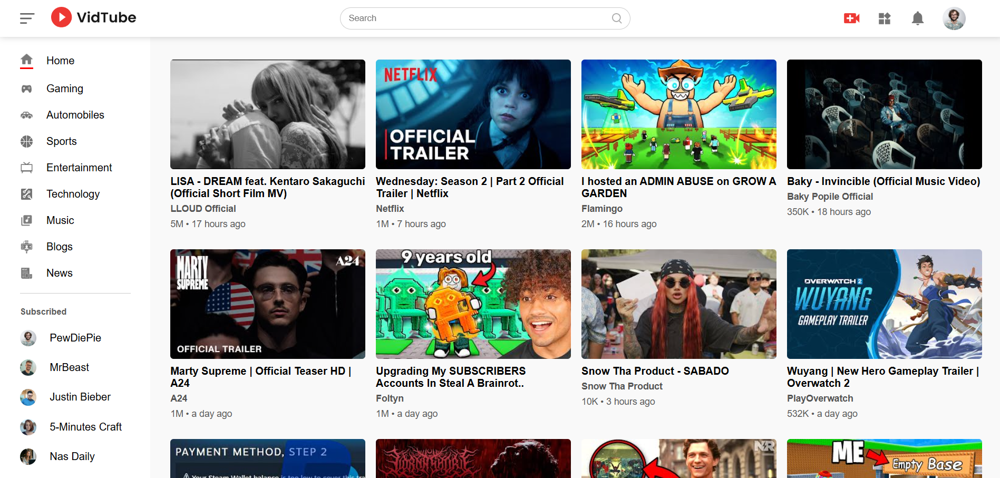
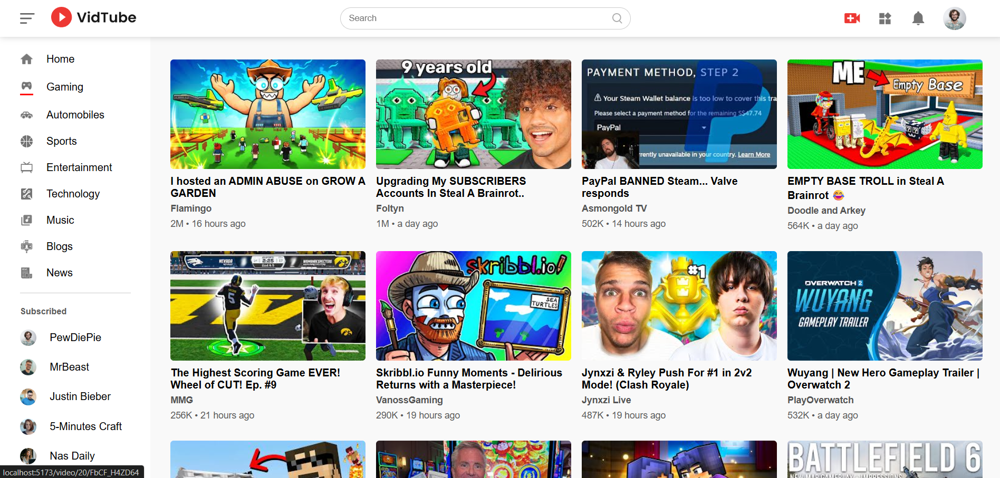
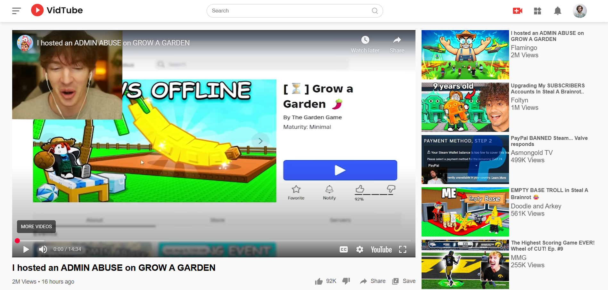
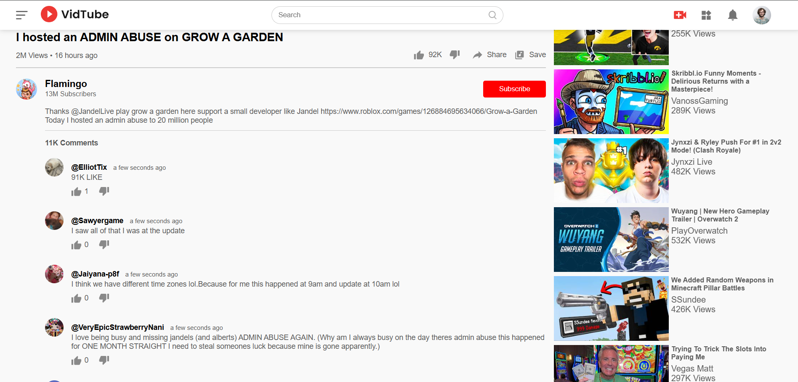

# 🎥 YouTube Clone (React + YouTube API)

A fully functional **YouTube Clone** built with **React.js** that uses the official **YouTube Data API v3** to fetch real-time videos, categories, and video details.  
This project replicates core YouTube features such as category-based feeds, video playback, recommended videos, and detailed video information.

---

## 🚀 Features

- 📂 **Category-wise Feed** — Browse videos by categories.
- ▶ **Video Playback** — Click any video to watch it directly.
- 📜 **Video Details** — Displays:
  - Video Title
  - Channel Image & Name
  - Views Count
  - Uploaded Time (e.g., "2 days ago")
  - Likes Count
  - Comments Data
- 📌 **Recommended Videos** — Suggested based on the selected video.

---

## 🛠️ Tech Stack

- **Frontend:** React.js
- **API:** YouTube Data API v3
- **Routing:** React Router DOM
- **State Management:** useState, useEffect

---

## 📷 Screenshots

### 🏠 Home Page (Category-wise Feed)

### 🏠 Gaming Category Feed 

### 📺 Video Details Page

### 🎯 Video Comments and Channel Info

---